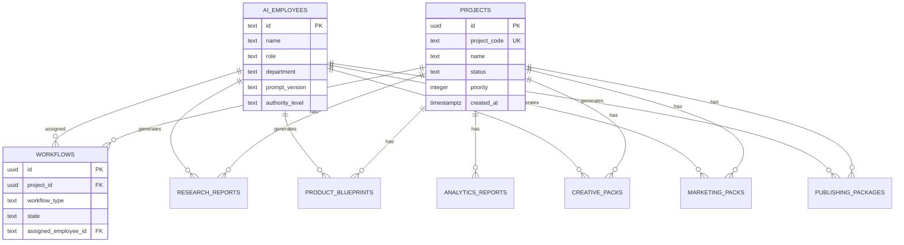

# ER Diagram

Version: 0.1.0
Sprint: 1D

```mermaid
erDiagram
  PROJECTS ||--o{ WORKFLOWS : owns
  PROJECTS ||--o{ RESEARCH_REPORTS : has
  PROJECTS ||--o{ PRODUCT_BLUEPRINTS : has
  PROJECTS ||--o{ CREATIVE_PACKS : has
  PROJECTS ||--o{ MARKETING_PACKS : has
  PROJECTS ||--o{ PUBLISHING_PACKAGES : has
  PROJECTS ||--o{ ANALYTICS_REPORTS : has
  AI_EMPLOYEES ||--o{ WORKFLOWS : assigned
  AI_EMPLOYEES ||--o{ RESEARCH_REPORTS : generates
  AI_EMPLOYEES ||--o{ PRODUCT_BLUEPRINTS : generates
  AI_EMPLOYEES ||--o{ CREATIVE_PACKS : generates
  AI_EMPLOYEES ||--o{ MARKETING_PACKS : generates
  AI_EMPLOYEES ||--o{ PUBLISHING_PACKAGES : generates

  PROJECTS {
    uuid id PK
    text project_code UK
    text name
    text status
    integer priority
    timestamptz created_at
  }

  AI_EMPLOYEES {
    text id PK
    text name
    text role
    text department
    text prompt_version
    text authority_level
  }

  WORKFLOWS {
    uuid id PK
    uuid project_id FK
    text workflow_type
    text state
    text assigned_employee_id FK
  }
```
