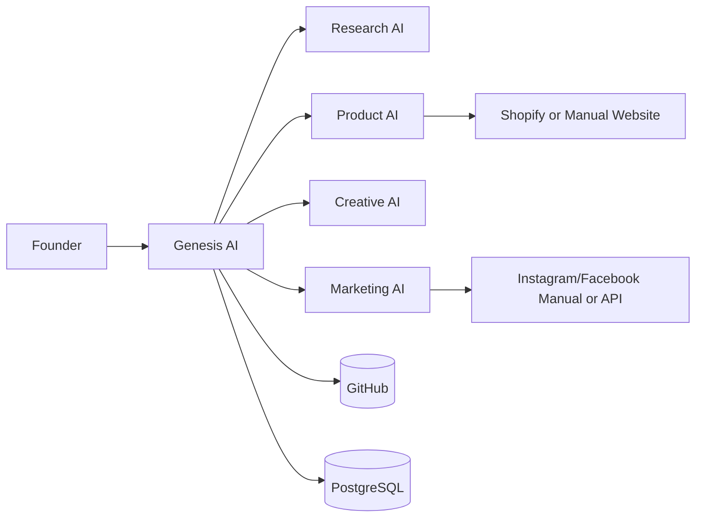
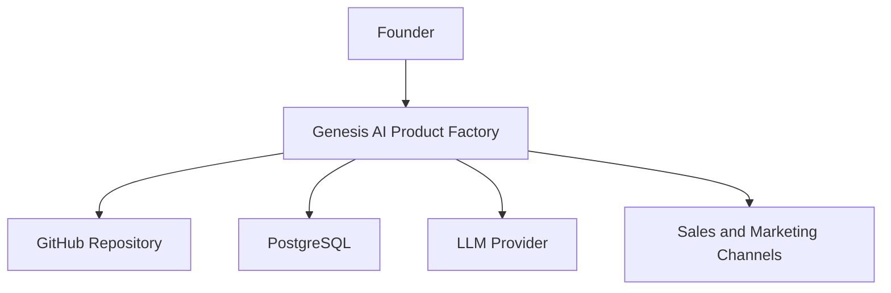
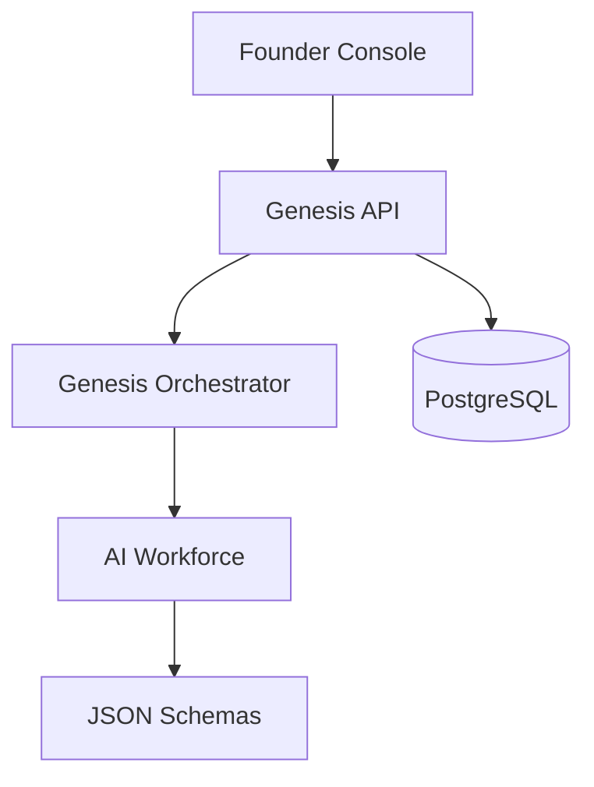
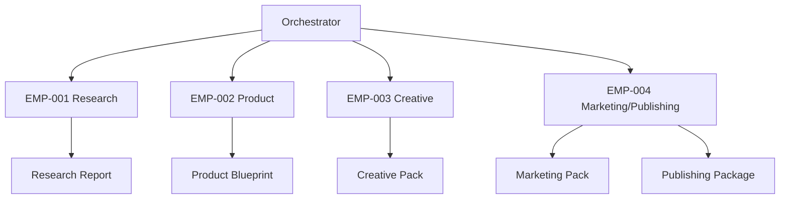
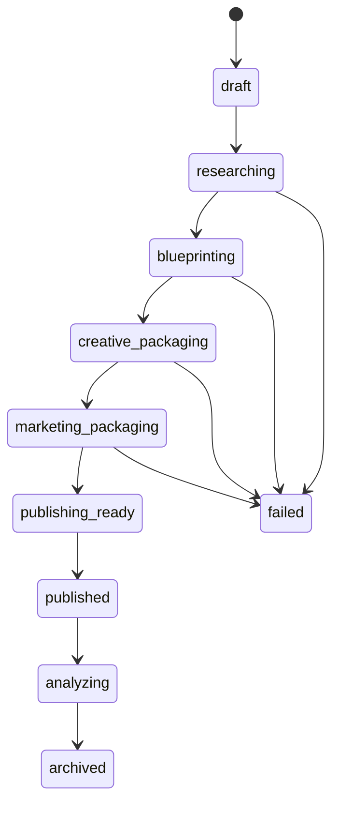
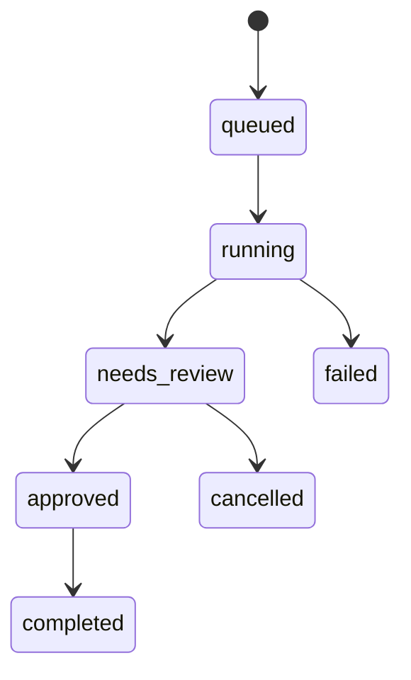
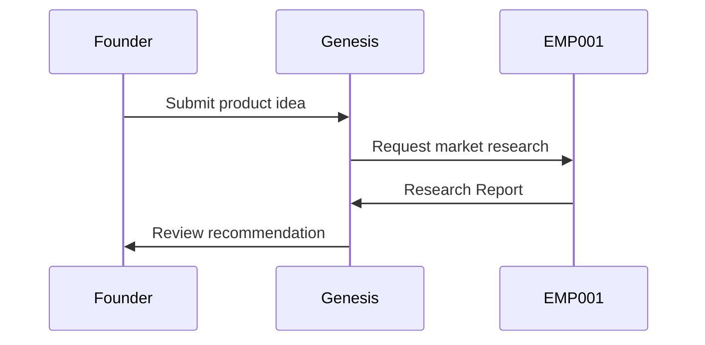
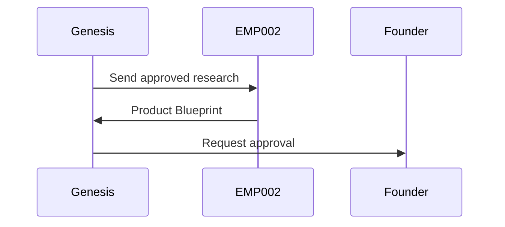
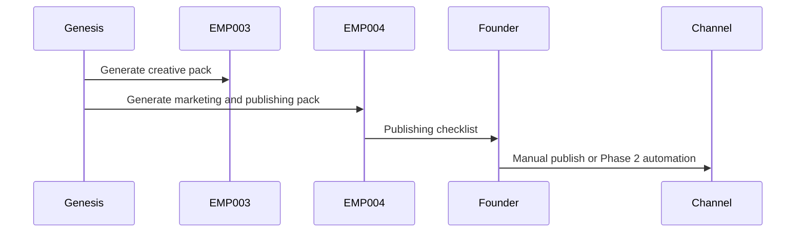

# System Context and Workflow Diagrams

Version: 0.1.0
Sprint: 1D

## System Context

## C4 Context

## C4 Container

## C4 Component

## Project State Machine

## Workflow State Machine

## Research Sequence

## Product Sequence

## Publishing Sequence

